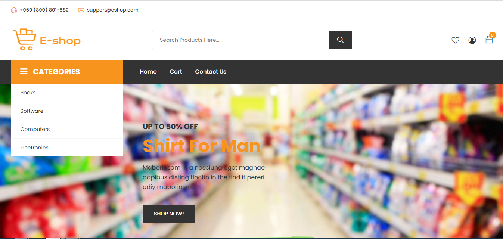

## Introduction
EShop is an e-commerce web application for selling products online.

## Informations
-  Status: under development 
- Lastest version 1.0 
- Sector: ecommerce
-  Created: September 2020 
- Last updated: September 2020

## Table of contents
* [Documentation](#general-info)
* [Demo](#demo)
* [Screenshots](#screenshots)
* [Technologies](#technologies)
* [Setup](#setup)
* [Features](#features)
* [Status](#status)
* [Contact](#contact)
* [License](#license)

## Documentation
https://github.com/aniskchaou/ESHOP-BACKEND-USER/wiki

## Demo
https://e-commerce-angular-frontend.herokuapp.com/

## Screenshots

## Technologies
* Spring boot
* Angular

## Setup

## Features
 -  Select products by category 
 - View the product details 
 - Add a product to the cart 
 - Manage cart Search for products 
 - Check out the product

## Contact
contact@delta-dev-software.com

## License
<a href="license.txt">MIT License</a>
